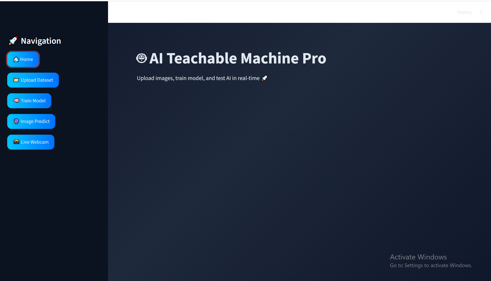
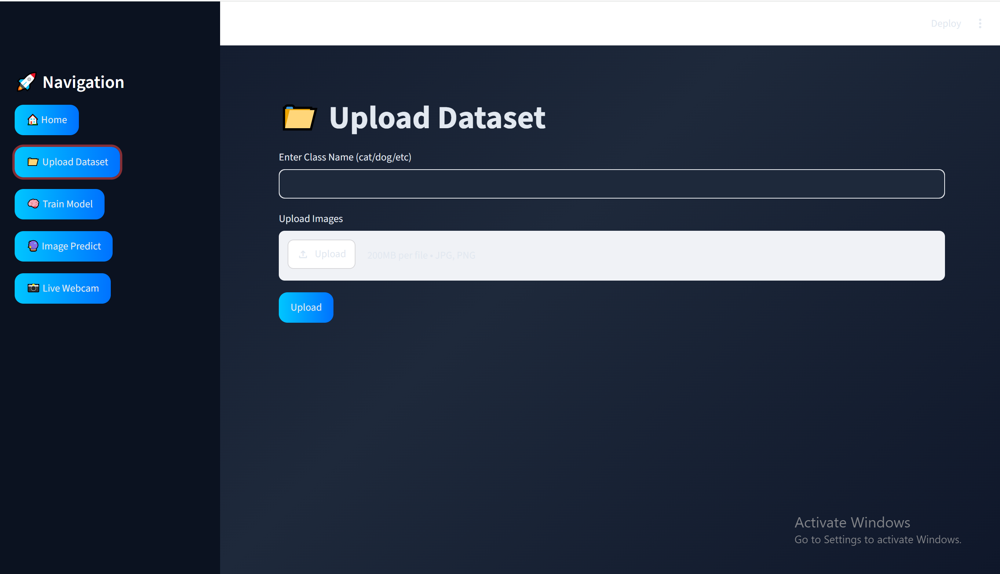
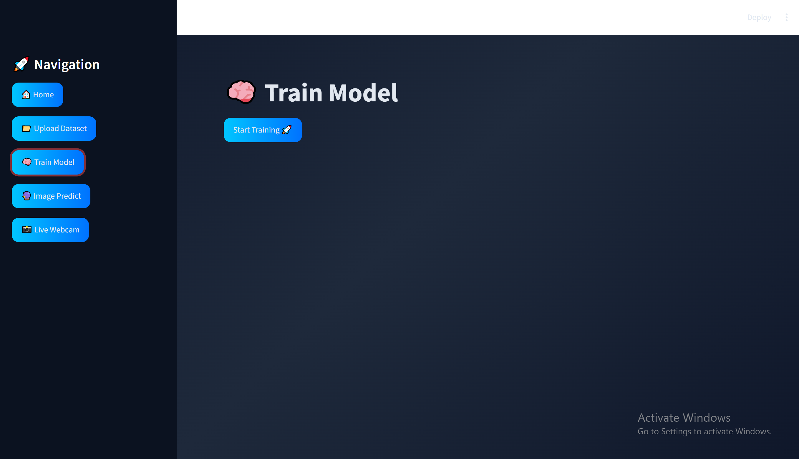
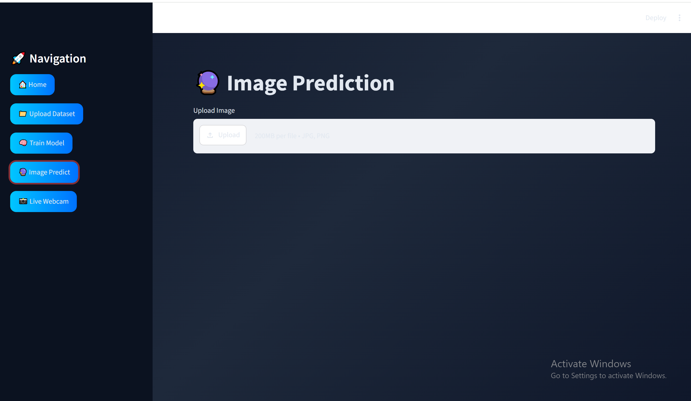

# 🧠 Teachable Machine Clone with FastAPI, PyTorch, Streamlit & Docker

A custom image classification web application inspired by Google's Teachable Machine. This project allows users to create custom classes, upload training images, train a machine learning model, and perform real-time image predictions through an interactive web interface.

---

## 🚀 Features

* Upload images for multiple custom classes
* Automatic dataset organization
* Feature extraction using MobileNetV3
* Model training using Logistic Regression
* Real-time image prediction
* Confidence score display
* FastAPI backend API
* Streamlit frontend dashboard
* Dockerized deployment
* Easy-to-use user interface

---

## 🛠️ Tech Stack

### Backend

* FastAPI
* PyTorch
* TorchVision
* Scikit-Learn
* NumPy
* Pillow

### Frontend

* Streamlit
* Requests
* OpenCV

### Deployment

* Docker
* Docker Compose

---

## 📂 Project Structure

```text
teachable_machine_project/
│
├── backend/
│   ├── main.py
│   ├── Dockerfile
│   ├── requirements.txt
│   ├── dataset/
│   ├── uploads/
│   └── models/
│
├── frontend/
│   ├── app.py
│   ├── Dockerfile
│   └── requirements.txt
│
├── docker-compose.yml
├── README.md
└── .gitignore
```

---

## ⚙️ How It Works

### Step 1: Create Classes

Users create custom classes such as:

* Cats
* Dogs
* Cars
* Flowers

### Step 2: Upload Images

Upload multiple images for each class through the Streamlit interface.

### Step 3: Train Model

The system:

1. Loads uploaded images
2. Extracts deep features using MobileNetV3
3. Encodes class labels
4. Trains a Logistic Regression classifier
5. Saves the trained model

### Step 4: Predict

Upload a new image and receive:

* Predicted Class
* Confidence Score

---

## 🧠 Machine Learning Pipeline

```text
Image
   ↓
Preprocessing
   ↓
MobileNetV3 Feature Extraction
   ↓
Feature Vector
   ↓
Logistic Regression
   ↓
Prediction
```

---

## 🐳 Run with Docker

### Build Containers

```bash
docker-compose build
```

### Start Application

```bash
docker-compose up
```

### Stop Application

```bash
docker-compose down
```

---

## 🌐 Application URLs

### Frontend

```text
http://localhost:8501
```

### Backend API

```text
http://localhost:8000
```

### API Documentation

```text
http://localhost:8000/docs
```

---

## 📊 Example Use Cases

* Custom Object Classification
* Educational Machine Learning Projects
* Image Recognition Demos
* AI Learning Applications
* Teachable Machine Alternatives

---

## 🎯 Future Improvements

* Confusion Matrix Visualization
* Training Metrics Dashboard
* Accuracy, Precision, Recall & F1 Score
* Multi-Class Support Enhancements
* Model Download Option
* Cloud Deployment
* User Authentication

---

## 📸 Screenshots

### Home Page


### Upload Samples


### Train Model


### Prediction


## 👨‍💻 Author

**Najam Rizvi**

Aspiring Data Analyst & Machine Learning Enthusiast

Skills:

* Python
* Machine Learning
* Data Analytics
* Streamlit
* FastAPI
* Docker
* SQL
* Power BI

---

## ⭐ Support

If you found this project useful, consider giving it a star on GitHub.
